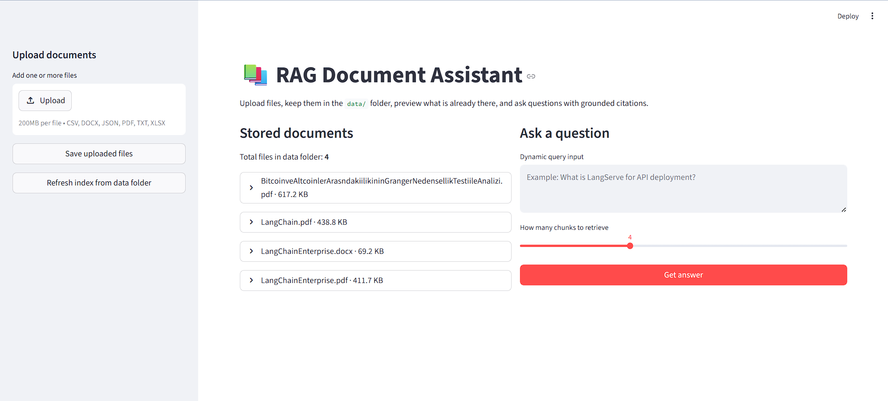

# 🧠 Groq-Powered Internal RAG Document Assistant

A production-style **Retrieval-Augmented Generation (RAG)** system that enables semantic search and question answering over internal documents using **FAISS, Sentence Transformers, and Groq LLM**, delivered through an interactive **Streamlit UI**.

---

## 🚀 Overview

This project implements an end-to-end **RAG pipeline** that allows users to:

* Upload internal documents (PDF, DOCX, CSV, etc.)
* Automatically process and chunk content
* Generate embeddings for semantic understanding
* Store and query vectors using FAISS
* Ask natural language questions
* Receive **context-grounded answers with citations**

The system ensures that responses are generated **only from retrieved context**, reducing hallucinations and improving reliability.

---

## 🧩 Problem Statement

Organizations store large volumes of unstructured data across multiple formats. Extracting insights manually is:

* Time-consuming
* Inefficient
* Error-prone

This system enables:

> ⚡ Fast, accurate, and explainable question-answering over internal documents.

---

## 🏗️ Architecture

```text
User Uploads Documents
        │
        ▼
Document Loading & Metadata Normalization
        │
        ▼
Text Chunking (Recursive)
        │
        ▼
Embedding Generation (MiniLM Model)
        │
        ▼
FAISS Vector Store
        │
        ▼
Query Embedding
        │
        ▼
Top-K Semantic Retrieval
        │
        ▼
Context Construction
        │
        ▼
Groq LLM Answer Generation
        │
        ▼
Final Answer + Citations
```

---

## 📸 Application Workflow (Screenshots)

All screenshots are stored in the `/screenshots` folder.

### 🟢 1. Application Start



### 📂 2. Upload Documents


### 🔄 3. Refresh Vector Index


### 📊 4. Query & Answer Output

[View Output](screenshots/Output.pdf)

---

## 📦 Libraries and Their Usage

### 📄 1. Document Loading & Preprocessing

* `langchain_community.document_loaders` → Multi-format document ingestion
* `PyPDFLoader` → PDF parsing
* `TextLoader` → TXT files
* `CSVLoader` → CSV data
* `Docx2txtLoader` → Word documents
* `JSONLoader` → JSON parsing
* `UnstructuredExcelLoader` → Excel files

📌 Purpose: Handle real-world document formats

---

### ✂️ 2. Text Chunking

* `langchain_text_splitters`
* `RecursiveCharacterTextSplitter`

📌 Purpose: Split large documents into manageable overlapping chunks

---

### 🧠 3. Embedding Generation

* `sentence_transformers`
* `SentenceTransformer (all-MiniLM-L6-v2)`
* `numpy`

📌 Purpose: Convert text into semantic vectors

---

### 🗄️ 4. Vector Storage & Retrieval

* `faiss`
* `pickle`

📌 Purpose: Store embeddings and perform fast similarity search

---

### 🔍 5. Retrieval + LLM Integration

* `langchain_groq`
* `ChatGroq`
* `python-dotenv`

📌 Purpose: Generate answers using retrieved context and manage API keys securely

---

### 🖥️ 6. Frontend (UI)

* `streamlit`

📌 Purpose:

* File uploads
* Query interface
* Display results with citations

---

### ⚙️ 7. Core Python Utilities

* `os`, `sys`, `pathlib`, `typing`

📌 Purpose: File handling, structure, and maintainability

---

## 🧠 Summary

| Component        | Library Used                   | Purpose                |
| ---------------- | ------------------------------ | ---------------------- |
| Document Loading | LangChain Loaders              | Multi-format ingestion |
| Chunking         | RecursiveCharacterTextSplitter | Text segmentation      |
| Embeddings       | Sentence Transformers          | Semantic understanding |
| Vector Store     | FAISS                          | Fast retrieval         |
| LLM              | Groq + LangChain               | Answer generation      |
| UI               | Streamlit                      | User interaction       |
| Utilities        | NumPy, OS, Pathlib             | Data handling          |

---

## 🚀 Why This Stack?

* Handles real-world documents
* Enables fast semantic search
* Uses low-latency Groq inference
* Modular and scalable design
* Simple and interactive UI

---

## 📁 Project Structure

```text
RAGGithub/
│
├── app.py
├── README.md
├── requirements.txt
├── .env.example
├── .gitignore
│
├── src/
│   ├── data_loader.py
│   ├── embedding.py
│   ├── vectorstore.py
│   └── search.py
│
├── data/
│   └── .gitkeep
│
├── screenshots/
│   ├── start.png
│   ├── save-uploaded-files.png
│   ├── refresh-index.png
│   └── output.png
```

---

## 🛠️ Setup Instructions

```bash
git clone https://github.com/abssinghal/RAGGithub.git
cd RAGGithub

python -m venv .venv
.\.venv\Scripts\Activate.ps1

pip install -r requirements.txt

# create .env file
GROQ_API_KEY=your_api_key_here

streamlit run app.py
```

---

## 🧪 Example Query

```
What is LangServe used for?
```

---

## 📌 Resume Description

**Built a Groq-powered RAG document assistant using LangChain, FAISS, and Sentence Transformers to perform citation-based semantic search and question answering over multi-format internal documents via a Streamlit interface.**

---

## 👨‍💻 Author

**Abhishek**
